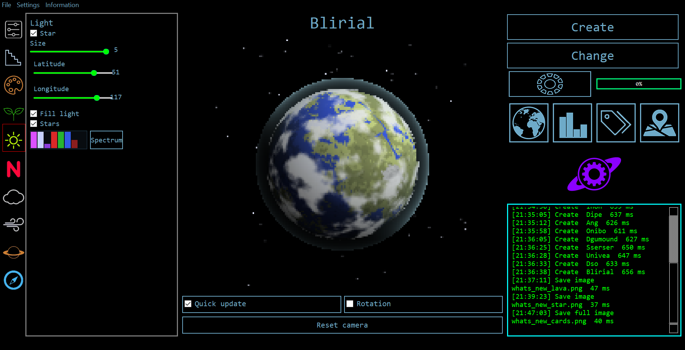
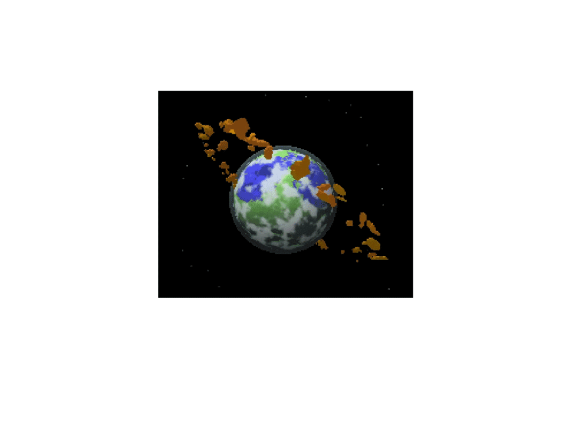
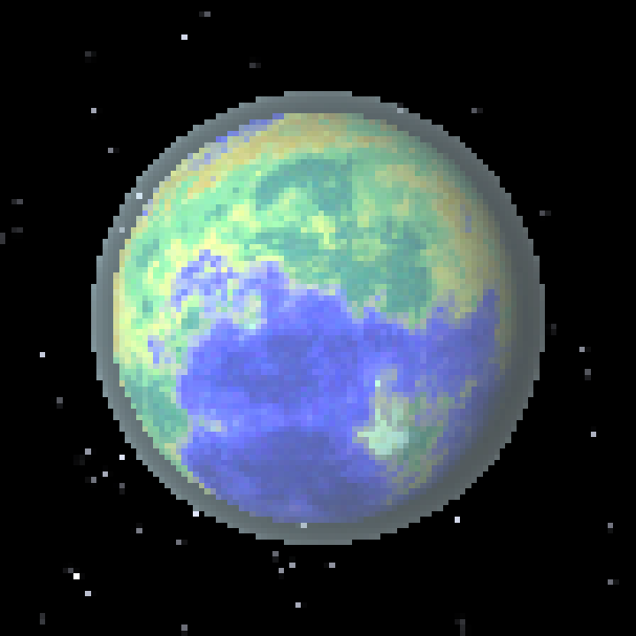
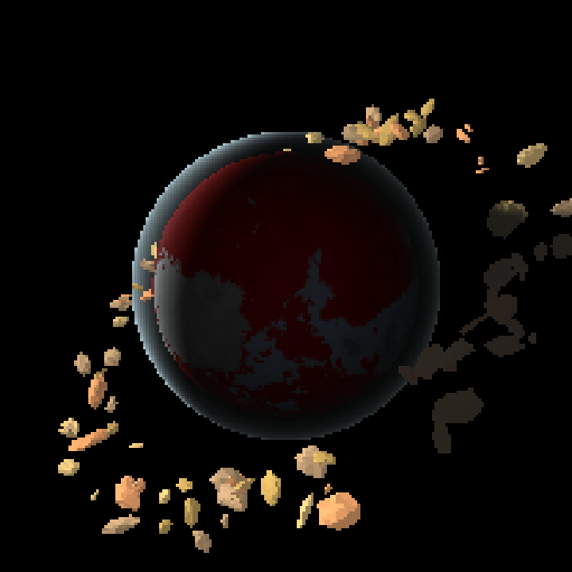
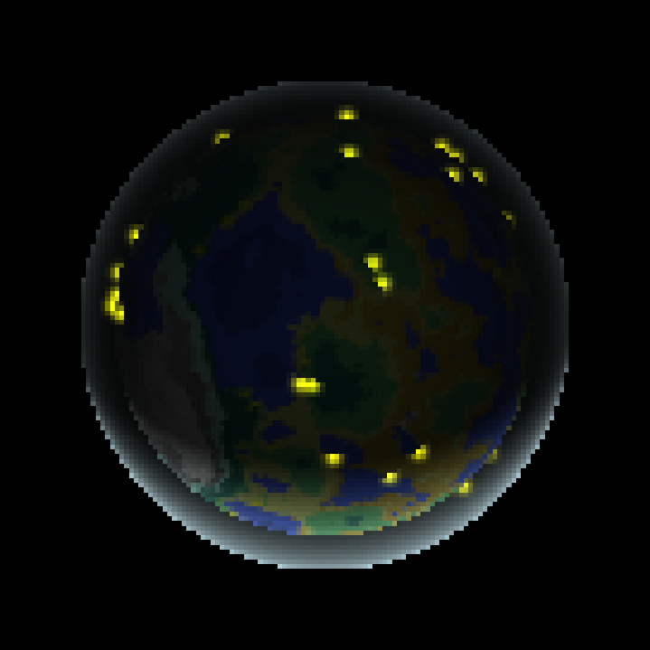
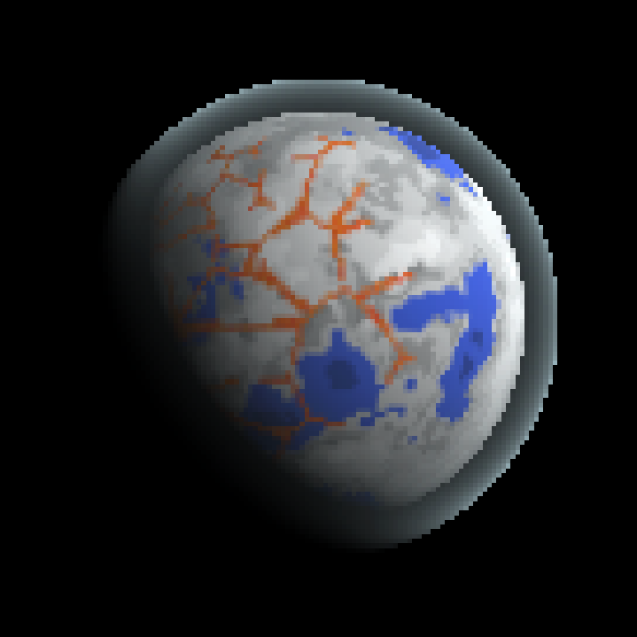
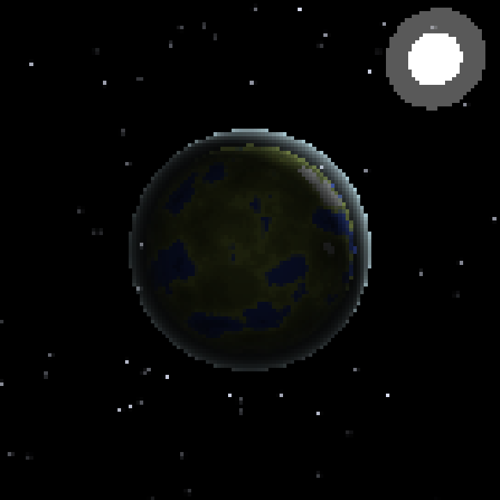
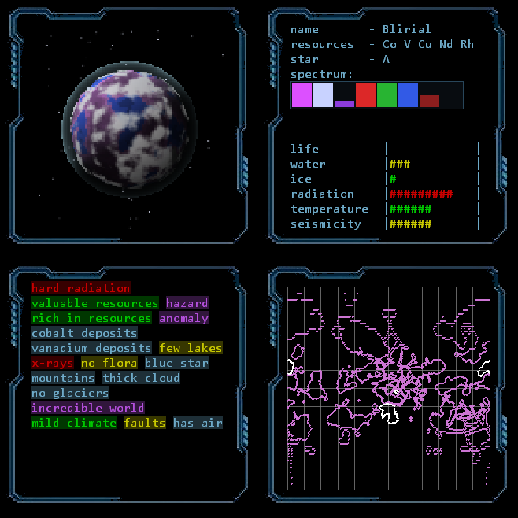
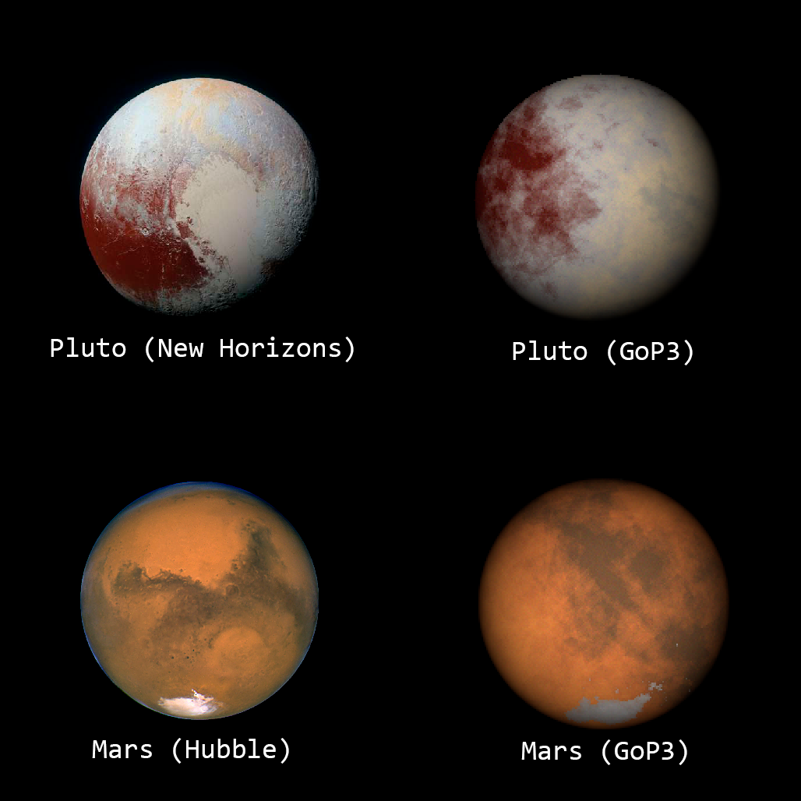

# God of Pixels 3

> A graphical planet editor with procedural generation.

Create, customize and simulate your own planets.

Shape the terrain, add oceans and atmosphere, grow plants, control the climate, configure the star and much more.

---

# CORE Update — v2.0.0

> **A new foundation for God of Pixels 3.**

The **CORE Update** is one of the biggest technical change in the history of God of Pixels 3.

The original custom 2D rendering system has been replaced with a new **OpenGL-based 3D renderer**.

This is more than a visual upgrade. God of Pixels 3 is now a true 3D application, with a completely new rendering foundation that opens the way for future features and more advanced planetary simulation.

Alongside the new renderer, CORE introduces many new features and systems for creating and exploring planets.

## What's new

### New 3D Renderer

The original 2D renderer has been replaced by a new OpenGL-based 3D rendering system.

You can zoom and rotate your project.

### Meteorites

The planet may have a meteorite ring.

### Civilization

After many years... intelligent life returns to the planet.

### Lava Rifts

Add extreme with lava rifts to your planets.

### Stars

God of Pixels 3 can now simulate and visualize stars with their spectrum.

### New planet cards

Interesting additional information for your project on one dashboard.

* Preview from main window
* Description with key indicators
* Short section with tags (instead star system map)
* Map in the Mercator projection (instead galactic map)

### And also...

* new landscape generation algorithm "Noise"
* widget for setting the average surface color
* quick update function - changes without "Update" button
* dependence of resources on the surface color
* achievements
* and more

---

# About

It's a simple constructor or graphic editor, or simulation or something else.

Here you can create your own planet. Configure ocean level (or make it desert), set comfortable temperature value (or begin forever winter), create plants (or make the world lifeless). It's only small part of opportunities.

Create your own world among infinity space.

It begun some years ago as a small school project, and now i want to share it. I saw as numbers and algorithms borns small worlds just in front of eyes. I  just wanted to create something beautiful.

# Quality example

Here are some planets created with God of Pixels 3.

The image above shows render examples of Pluto and Mars created with God of Pixels 3 alongside images from Hubble.

---

# Links

* [God of Pixels 3 on itch.io](https://rbnik.itch.io/god-of-pixels-3)
* [CORE trailer (soon)](https://example.com)
* [Gameplay trailer](https://www.youtube.com/watch?v=IHq2dUxOy3s)
* [Cinematic trailer](https://www.youtube.com/watch?v=Ci2XzR3cnhA)
* [Climate simulation](https://elibrary.ru/item.asp?id=80284921)
