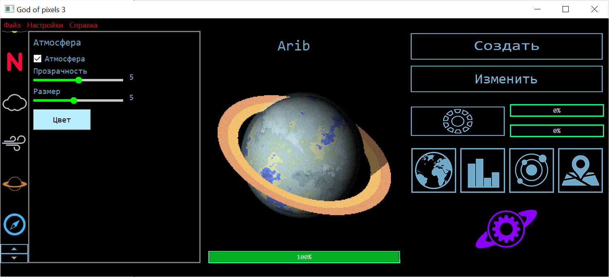

# God of Pixels 3

Graphical planet editor with procedural generation.

Here you can create unique planet and castomise it. Change temperature, add atmosphere and clouds, grow plants and do more other things.

There is render example, Pluto and Mars from God of Pixels 3 and from Hubble:

## Links

 - my page on [itch.io](https://rbnik.itch.io/god-of-pixels-3)

 - "gameplay" trailer on [youtube.com](https://www.youtube.com/watch?v=IHq2dUxOy3s)

 - "cinematic" trailer on [youtube.com](https://www.youtube.com/watch?v=Ci2XzR3cnhA)

 - more about climate simulation on [elibrary.ru](https://elibrary.ru/item.asp?id=80284921)

